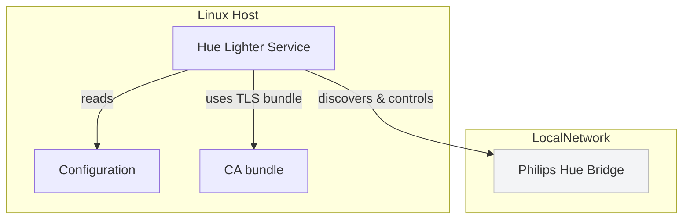
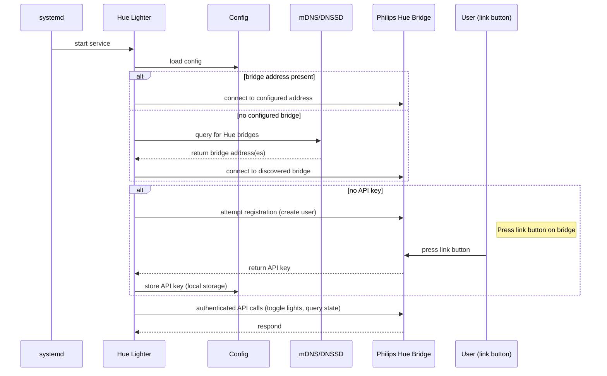

# Architecture

This document contains a compact container diagram for the running system and a sequence diagram describing bridge discovery.

## Container Diagram

Notes:
- `Hue Lighter Service` runs on the host (systemd) and is responsible for discovery, registration, and automation.
- `Configuration` defines which lights to manage and where the bridge is located (IP/hostname or discovery fallback).
- The service uses the CA bundle to validate TLS when talking to the bridge.

## Bridge discovery — Sequence Diagram

Notes:
- Discovery uses mDNS/DNSSD to find local Philips Hue Bridges when no address is configured.
- Registration requires the physical link button on the bridge to be pressed; the app will prompt and retry as needed.
- Once registered, the app stores the API key and proceeds to control configured lights.

